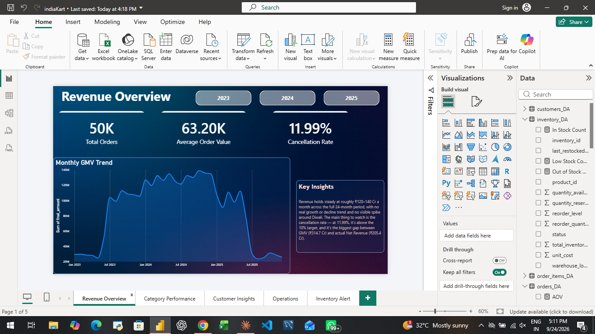
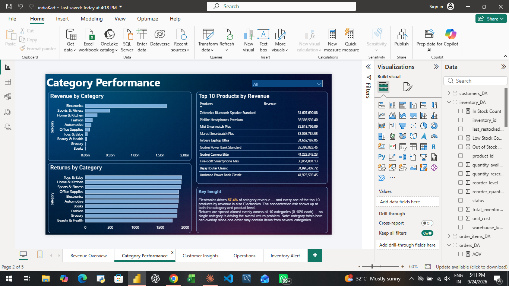
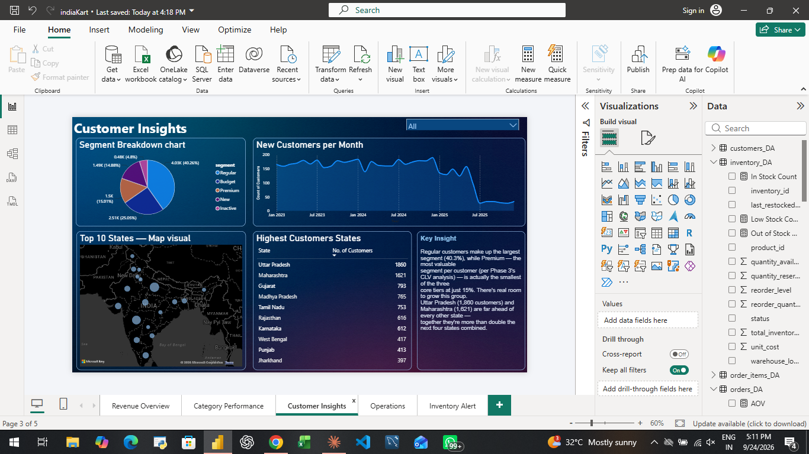
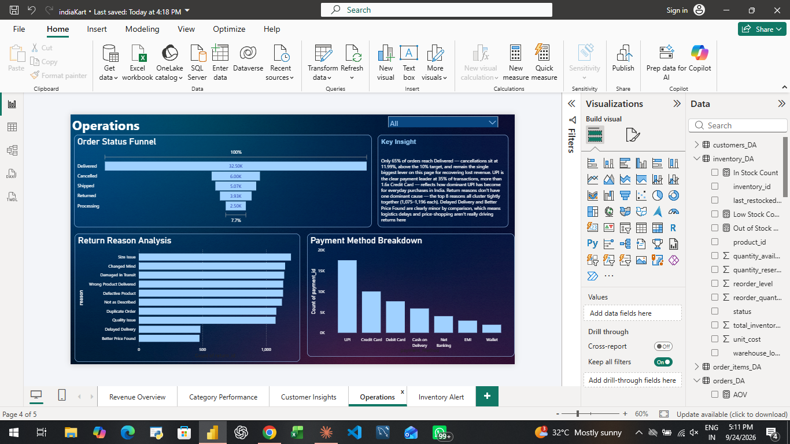
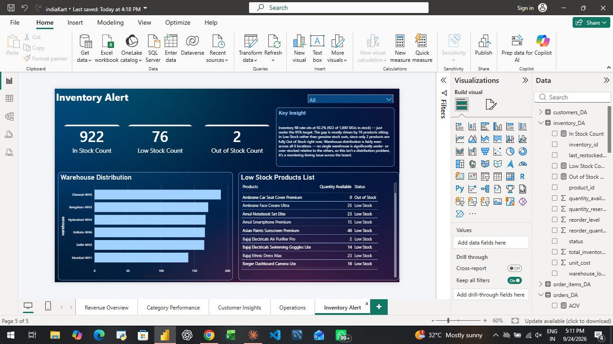

# IndiaKart E-Commerce Analytics

End-to-end analytics project on a 24-month e-commerce dataset (50,000 orders, ~216K records across 8 tables) — from raw data to a CEO-facing management report.

**Stack:** Python (pandas, matplotlib, seaborn) · Power BI · DAX

---

## The business question

IndiaKart's leadership needed answers to six questions before their next planning cycle: which categories drive revenue, why orders get cancelled, which customers matter most, whether there's a seasonal pattern, which markets are biggest, and whether the return rate is healthy.

## What I found

- **A third of order value never converts to revenue.** GMV was ₹314.7 Cr, but only ₹205.4 Cr (65.3%) became actual delivered revenue — driven by a cancellation rate of **11.99%** against a 10% target.
- **Returns are a systemic problem, not a category problem.** The naive return rate calculation gave 30.77% — investigating further, I found 1,740 return records attached to orders that were never actually delivered (a data inconsistency). After correcting for it, the defensible return rate is **22.67%**, still ~3x the 8% target, spread almost evenly across all 10 categories.
- **Electronics carries 57.4% of all revenue** — more than 3x the next largest category — a real concentration risk sitting just under the 60% threshold flagged in the brief.
- **Premium customers don't have the highest average order value — Budget does.** Investigating this counter-intuitive result showed Premium customers order ~3x more frequently instead, making them the most valuable segment by lifetime spend despite the lowest AOV.

Full findings, risks, and recommendations are in [`report/IndiaKart_Management_Report.docx`](./report).

## Dashboard

A 5-page Power BI dashboard built on the cleaned dataset:

| Revenue Overview | Category Performance |
|---|---|
|  |  |

| Customer Insights | Operations |
|---|---|
|  |  |

| Inventory Alert |
|---|
|  |

## Project structure

```
notebooks/   Phase 1–3: data cleaning, EDA, KPI calculations (Jupyter)
dashboard/   Power BI file (.pbix)
report/      Management summary report (.docx)
screenshots/ Dashboard page exports
```

## Process

**Phase 1 — Data Cleaning & QC.** Audited all 8 tables for nulls, duplicates, type issues, outliers, and referential integrity. Caught a real bug along the way: comparing `delivered_date` to `order_date` while both were still stored as text produced 5,790 false "invalid" rows — fixed by converting both to proper datetimes first.

**Phase 2 — Exploratory Data Analysis.** 10 charts covering revenue trends, category mix, customer segments, and returns, each with a written interpretation grounded in the actual numbers — not just a chart with no takeaway.

**Phase 3 — KPI Calculations.** All 10 core business KPIs (GMV, Net Revenue, AOV, Cancellation Rate, Return Rate, CLV, MoM Growth, Category Share, Payment Failure Rate, Inventory Fill Rate), cross-checked against the Phase 1/2 findings for consistency.

**Phase 4 — Dashboard & Report.** A 5-page interactive Power BI dashboard and a 2-page report written for a non-technical executive audience.

## Key KPIs at a glance

| KPI | Value | Target | Status |
|---|---|---|---|
| GMV | ₹314.7 Cr | — | — |
| Net Revenue | ₹205.4 Cr | — | 65.3% of GMV |
| Cancellation Rate | 11.99% | < 10% | ❌ |
| Return Rate | 22.67% | < 8% | ❌ |
| Payment Failure Rate | 3.50% | < 2% | ❌ |
| Inventory Fill Rate | 92.2% | > 95% | ❌ |
| Top Category Share | 57.4% | < 60% | ⚠️ |

*6 of 10 KPIs missed their target — full breakdown and recommendations in the management report.*

---

**Author:** Rao Ammar
